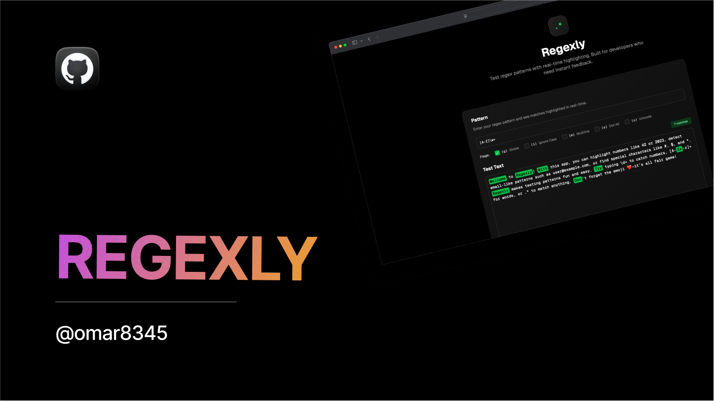

<p align="center">
  
</p>

<h1 align="center">Regexly</h1>
<p align="center">
  <b>Test, visualize, and master regular expressions in real time.</b><br>
  <i>Built for developers who need instant feedback and a beautiful UI.</i>
</p>

---

## 🚀 Features

- ⚡ **Live Regex Testing:** See matches highlighted instantly as you type.
- 🎨 **Modern UI:** Clean, dark-themed interface with beautiful highlighting. Light on your eyes!
- 🏷️ **Flag Toggles:** Easily enable/disable regex flags with a click.
- 🖱️ **Custom Selection:** Visualize your own text selection and matches.
- 💾 **Open Source:** MIT licensed and ready for your contributions.

---

## 🛠️ Getting Started

```bash
git clone https://github.com/omar8345/regexly.git
cd regexly
npm install
npm run dev
```

Then open [http://localhost:3000](http://localhost:3000) in your browser.

---

## 📦 Tech Stack

- **Next.js**
- **Tailwind CSS**
- **TypeScript**

---

## 🤝 Contributing

Pull requests are welcome! For major changes, please open an issue first to discuss what you would like to change.

---

## 📧 Contact

- **Omar (Developer)**:
  - Twitter: [@DevOmar100](https://x.com/DevOmar100)
  - GitHub: [Omar8345](https://github.com/Omar8345)
  - Email: yo@omarcodes.io

---

<p align="center">
  <a href="https://appwrite.io/" target="_blank" rel="noopener noreferrer" style="display:inline-flex;align-items:center;gap:4px;">
     Powered by Appwrite
  </a>
</p>
